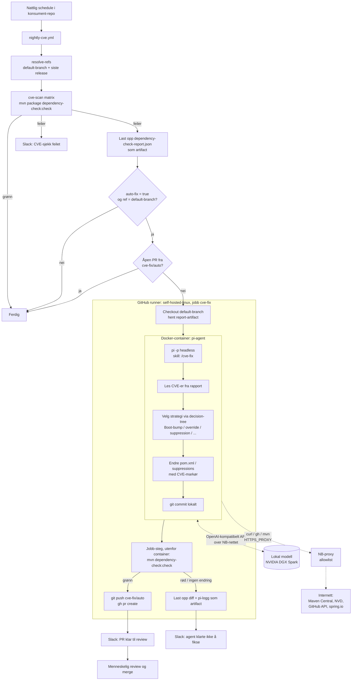
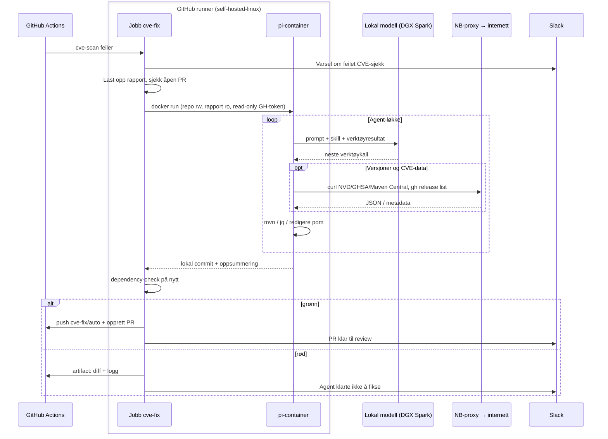

# Plan: automatisk CVE-fiks etter nattlig CVE-sjekk

Status: forslag

## Mål

Når `nightly-cve` feiler på default-branch, kjører en pi-agent i Docker mot en lokal modell skillen `/cve-fix`. Resultatet er en PR med forslag til fiks som ligger klar til review om morgenen.

## Fire spørsmål

| Spørsmål | Svar |
|---|---|
| Hvilket problem løser dette? | Når den nattlige CVE-sjekken feiler, må noen i dag fikse det manuelt med `/cve-fix`. Med denne løsningen ligger en PR med forslag til fiks klar om morgenen. |
| Trenger vi det? | Dependabot dekker direkte bumps, men ikke Spring-property-overrides, BOM-overrides, suppressions eller interne NB-avhengigheter. Det er der skillen gir noe ekstra. Er de fleste funnene rene bumps, holder Dependabot. |
| Hva betyr ferdig? | Når CVE-sjekken feiler, finnes det én åpen PR fra `cve-fix/auto` med grønn `dependency-check`. Lykkes ikke agenten, går det et Slack-varsel med lenke til loggen, og ingen PR blir laget. |
| Hvordan verifiserer vi? | Først en pilot mot `github-java-sandbox` med en avhengighet som er sårbar med vilje. Kjør workflowen manuelt og sjekk at PR-en dukker opp og at sjekken i den er grønn. |

## Arkitekturvalg

- **Egen jobb i `nightly-cve.yml`.** En jobb med `needs: cve-scan` og `if: failure()` følger med automatisk.
- **Valgfritt.** Input `auto-fix` har default `false`.
- **Bare default-branch.** Feiler prod-release-taggen mens main er grønn, er fiksen allerede på main, og det som trengs er en ny release. Det dekker det eksisterende Slack-varselet.
- **pi-containeren kjører på GitHub-runneren.** Jobben `cve-fix` starter den med `docker run` på `self-hosted-linux`, og repoet er allerede sjekket ut i jobbens workspace. Vi trenger ingen egen agent-tjeneste.
- **Modellen kjører på en NVIDIA DGX Spark i NB-nettet.** Containeren kaller den over et OpenAI-kompatibelt API. Endepunktet kommer fra Vault som `MODEL_URL` og hardkodes ikke i workflowen.
- **Én modell deles av alle repoer.** Det er bare én DGX Spark. Bruk `concurrency: group: cve-fix-model` slik at bare én autofiks kjører om gangen, og sett en romslig `timeout-minutes`.
- **Agenten får bare lesetilgang til GitHub.** Agenten endrer filer og committer lokalt. Workflowen kjører verifiseringen på nytt, pusher og lager PR, alt utenfor containeren. Agenten trenger likevel et read-only token, fordi `check-versions.sh` slår opp releases og tags for interne `no.nb.*`-avhengigheter med `gh`.
- **Web-oppslag går gjennom NB-proxyen.** pi har ikke noe eget web-verktøy. Agenten bruker `curl` og `gh` fra bash, og Maven bruker `MAVEN_OPTS`. Alle tre går ut gjennom proxyen. Se [Nettverk og web-oppslag](#nettverk-og-web-oppslag).
- **Sannhetssjekk utenfor agenten.** `dependency-check` kjøres på nytt i workflowen etter at agenten er ferdig. Vi stoler ikke på agentens egen verifisering.
- **Idempotens.** Er det allerede en åpen PR fra `cve-fix/auto`, hopper jobben over.

## Flyt



## Sekvens: hvem gjør hva



## Steg

| # | Steg | Verifisering |
|---|---|---|
| 1 | **Lokal prototype:** `docker run` med pi mot sandbox-repoet og den lokale modellen | pi kjører headless, finner skillen og lager en commit som gir grønn `dependency-check` |
| 2 | **Headless-variant av `cve-fix`:** steg 2 («Ask the user») henter CVE-er fra prompt eller rapport, steg 9 (retrospektiv) skrives til fil og havner i PR-body, `mvnd` byttes til `mvn`, og seksjonen om subagenter tåler at agenten ikke har subagenter | Skillen kjører fra start til slutt uten at noen svarer på noe |
| 3 | **Docker-image `pi-agent`** og workflowen `build-pi-agent-image.yaml`, se [Docker-image](#docker-image-pi-agent) | `docker run --rm -e MODEL_URL -e MODEL_API_KEY <image> --version` skriver ut pi-versjonen, og `docker run --rm --entrypoint ls <image> /home/agent/.agents/skills` viser `cve-fix` og `maven-update` |
| 4 | **Workflow:** input `auto-fix`, artifact-upload i `cve-scan` og ny jobb `cve-fix` | Kjør mot sandbox fra en testbranch |
| 5 | **Pilot:** sandbox og ett ekte repo i 2–3 uker | Tell hvor mange PR-er som blir merget, endret eller lukket |

## Sikkerhet

- **Prompt injection.** Agenten leser tekst fra NVD og GHSA og POM-er fra internett, og den har shell. Tiltak:
  - ingen skrive-token i containeren, bare et read-only GitHub-token
  - all utgående trafikk går gjennom NB-proxyen med allowlist, se [Nettverk og web-oppslag](#nettverk-og-web-oppslag)
  - det read-only tokenet kan lese private NB-repoer. Uten allowlist kan en agent som er manipulert, sende innholdet ut. Allowlisten er derfor det viktigste tiltaket her
  - diffen blir alltid reviewet av et menneske
- **Ingen auto-merge.** CODEOWNERS sørger for at PR-ene får review.
- **Secrets.** `vault-action` med `*` eksporterer alt. Gi containeren bare de variablene Maven trenger, ikke hele miljøet.
- **Interne adresser.** Proxy-adresser og interne vertsnavn skal ikke inn i PR-bodies eller andre steder som kan bli offentlige.

## Risiko og åpne spørsmål

- **Modellkapasitet er den største usikkerheten.** Skillen er rundt 300 linjer pluss `cve-patterns.md`. Piloten i steg 5 viser om kvaliteten holder.
- **pi (`@earendil-works/pi-coding-agent` 1.0.4) må verifiseres i steg 1:**
  - `-p` og `--mode json` kjører uten interaktiv bruker
  - skills lastes fra `~/.agents/skills/`
  - custom provider settes opp i `models.json`
  - `PI_CODING_AGENT_DIR` og `PI_OFFLINE` finnes
  - at `/skill:cve-fix` kan kalles i `-p`-modus
  - at verktøykall fungerer med Qwen via vLLM
- **AGENTS.md i konsument-repoene.** pi laster `AGENTS.md` automatisk. NB-reglene der sier at agenten skal vente på godkjenning og bare committe når den blir bedt om det, så en headless kjøring ville stoppet opp. Kjør derfor med `--no-context-files`.
- **Java-versjon.** Imaget har bare JDK 21, som er default i `nightly-cve`. Repoer som bruker en annen versjon, må vente til vi trenger et image per JDK-versjon.
- **Runner.** Vi trenger Docker på `self-hosted-linux` og en åpning i brannmuren fra runnerne til DGX Spark.
- **Ytelse på DGX Spark.** Med 128 GB delt minne får det plass modeller på rundt 70–120B parametere i kvantisert form. Begrenset minnebåndbredde gjør likevel genereringen treg. Mål hvor lang tid én kjøring tar i steg 1, og sett timeout og concurrency ut fra det.
- **Samtidige jobber.** Kjører mange repoer `nightly-cve` på samme tidspunkt, havner autofiks-jobbene i kø mot én GPU. Vurder å spre kjøretidspunktene utover natten.
- **Lisenser i imaget.**
  - pi: MIT (verifisert på npm)
  - Node.js: MIT
  - Temurin JDK: GPLv2 med Classpath Exception
  - Maven: Apache-2.0
  - yq: MIT
  - gh: MIT
  - Debian-pakkene: blandede OSS-lisenser

  Imaget brukes bare internt og distribueres ikke.
- **HTTP uten TLS.** Endepunktet bruker ren HTTP. Det går bare internt, men CVE-data og POM-innhold går ukryptert over nettet.

## Modell og pi-konfigurasjon

| | |
|---|---|
| Modell | `qwen3.8-flash-next` (Qwen3.8-Flash-Next-NVFP4) |
| API | OpenAI-kompatibelt (`openai-completions`) |
| Context window | 262 144 tokens. Det holder godt til skill, `cve-patterns.md` og rapport |
| Maks output | `maxTokens` er en innstilling i pi, ikke en grense på serveren. vLLM har `max_model_len` = 262 144 for input og output til sammen. Sett `maxTokens` til 32 768: Qwen3 bruker thinking-tokens fra output-budsjettet, og 8 192 kan kutte resonnementet midt i |

Entrypoint i containeren lager fila fra miljøvariabler som kommer fra Vault:

```json
{
  "providers": {
    "dgx-spark": {
      "api": "openai-completions",
      "apiKey": "${MODEL_API_KEY}",
      "baseUrl": "${MODEL_URL}",
      "models": [
        {
          "id": "qwen3.8-flash-next",
          "name": "Qwen3.8-Flash-Next-NVFP4",
          "contextWindow": 262144,
          "maxTokens": 32768,
          "input": ["text"]
        }
      ]
    }
  }
}
```

I entrypoint: `envsubst < models.json.tpl > "$PI_CODING_AGENT_DIR/models.json"`. Vi må verifisere i steg 1 at den ytre strukturen rundt `providers` er riktig.

## Docker-image: `pi-agent`

Det finnes ikke noe image i dag, så vi lager et nytt. Skillene bygges inn i imaget og pinnes til en tag i `nasa-library`.

### Innhold

| Del | Kilde | Hvorfor |
|---|---|---|
| Node 22 | base `node:22-bookworm-slim` | pi 1.0 krever Node 22.19 eller nyere |
| pi | `npm i -g --ignore-scripts @earendil-works/pi-coding-agent@<versjon>` | Agenten |
| JDK 21 | `COPY --from=eclipse-temurin:21-jdk` | Maven-bygg |
| Maven 3.9.9 | `COPY --from=maven:3.9.9-eclipse-temurin-21` | Samme versjon som `nightly-cve` |
| git, jq, curl, gettext-base | apt | Skillen og `envsubst` |
| yq | binær fra GitHub-release, pinnet | Kravene til skillen |
| gh | binær fra GitHub-release, pinnet | `check-versions.sh` slår opp interne NB-releases. |
| Skills `cve-fix`, `maven-update` | `nasa-library@<tag>` → `/home/agent/.agents/skills/` | `cve-fix` finner `check-versions.sh` under `~/.agents/skills` |

### Filer

Ny katalog `docker/pi-agent/` i dette repoet:

```
docker/pi-agent/
├── Dockerfile
├── entrypoint.sh
└── models.json.tpl
```

Skissen under er ikke testet:

```dockerfile
FROM node:22-bookworm-slim

ARG PI_VERSION=1.0.4
ARG YQ_VERSION=v4.44.3
ARG GH_VERSION=2.62.0

COPY --from=eclipse-temurin:21-jdk /opt/java/openjdk /opt/java/openjdk
COPY --from=maven:3.9.9-eclipse-temurin-21 /usr/share/maven /usr/share/maven

RUN apt-get update \
 && apt-get install -y --no-install-recommends git jq curl ca-certificates gettext-base \
 && rm -rf /var/lib/apt/lists/* \
 && curl -fsSL -o /usr/local/bin/yq \
      "https://github.com/mikefarah/yq/releases/download/${YQ_VERSION}/yq_linux_amd64" \
 && chmod +x /usr/local/bin/yq \
 && curl -fsSL "https://github.com/cli/cli/releases/download/v${GH_VERSION}/gh_${GH_VERSION}_linux_amd64.tar.gz" \
      | tar -xz -C /usr/local --strip-components=1 \
 && ln -s /usr/share/maven/bin/mvn /usr/local/bin/mvn \
 && npm install -g --ignore-scripts "@earendil-works/pi-coding-agent@${PI_VERSION}"

ENV JAVA_HOME=/opt/java/openjdk \
    PATH=/opt/java/openjdk/bin:$PATH \
    HOME=/home/agent \
    PI_CODING_AGENT_DIR=/tmp/pi \
    PI_OFFLINE=1

# Skills are checked out from nasa-library at a pinned tag by the image build workflow
COPY skills/ /home/agent/.agents/skills/
COPY models.json.tpl entrypoint.sh /opt/pi-agent/

RUN chmod -R a+rX /home/agent && chmod a+x /opt/pi-agent/entrypoint.sh

WORKDIR /workspace
ENTRYPOINT ["/opt/pi-agent/entrypoint.sh"]
```

```bash
#!/usr/bin/env bash
set -euo pipefail
: "${MODEL_URL:?}" "${MODEL_API_KEY:?}"
mkdir -p "$PI_CODING_AGENT_DIR"
envsubst < /opt/pi-agent/models.json.tpl > "$PI_CODING_AGENT_DIR/models.json"
exec pi --no-session --no-context-files \
  --model dgx-spark/qwen3.8-flash-next \
  --mode json "$@"
```

Containeren kjører som runner-brukeren (`--user`), så filene i workspace får riktig eier. `HOME` er satt til `/home/agent`, og skillene der er lesbare for alle.

### Kjøring fra jobben `cve-fix`

```bash
docker run --rm \
  --user "$(id -u):$(id -g)" \
  -v "$GITHUB_WORKSPACE:/workspace" \
  -v "$HOME/.m2:/home/agent/.m2" \
  -e MODEL_URL -e MODEL_API_KEY \
  -e MAVEN_OPTS \
  -e HTTPS_PROXY -e HTTP_PROXY -e NO_PROXY \
  -e https_proxy="$HTTPS_PROXY" -e http_proxy="$HTTP_PROXY" -e no_proxy="$NO_PROXY" \
  -e GH_TOKEN="$GH_READ_TOKEN" \
  "$PI_AGENT_IMAGE" \
  -p "/skill:cve-fix Run headless. CVEs are in /workspace/cve-report.json. Do not ask questions. Do not push. Commit locally when done." \
  > pi-log.jsonl
```

- `settings.xml` ligger allerede i workspace, fordi `setup-java-maven-and-cache` lager den der.
- Runnerens `~/.m2` monteres inn som cache.
- Bare variablene som er nevnt over, sendes inn. Resten av Vault-miljøet blir igjen utenfor containeren.

## Nettverk og web-oppslag

pi har ikke noe eget web-verktøy. Agenten «surfer» med `curl` og `gh` i bash, akkurat slik skillen beskriver. Det holder til JSON-API-ene den trenger.

**Proxy-variabler i containeren:**

| Variabel | Brukes av | Verdi |
|---|---|---|
| `HTTPS_PROXY`, `HTTP_PROXY` og små bokstaver | `curl`, `gh`, Node (pi) | NB-proxyen, hentet fra Vault (`PROXY_NB_HOST`/`PROXY_NB_PORT`) |
| `NO_PROXY` og små bokstaver | samme | `localhost,127.0.0.1,.nb.no` og modellens adresse, slik at trafikken til DGX Spark ikke går via proxyen |
| `MAVEN_OPTS` | Maven | Proxy-flaggene som `nightly-cve` allerede setter |

Vi setter både store og små bokstaver, fordi `curl` bare leser `http_proxy` med små bokstaver.

**Domener agenten trenger, og som bør stå i proxyens allowlist:**

| Domene | Brukes til |
|---|---|
| `repo1.maven.org`, `central.sonatype.com`, `search.maven.org` | Versjonsoppslag i `check-versions.sh` og BOM-POM-er |
| `services.nvd.nist.gov` | CVE-detaljer og versjonsintervaller |
| `api.github.com` | GHSA-advisories og `gh` for interne NB-releases |
| `github.com`, `raw.githubusercontent.com` | Release notes og `package.json` for interne avhengigheter |
| `spring.io` | Kompatibilitetsmatrisen for Spring Cloud |
| Artifactory (internt, via `NO_PROXY`) | Maven-avhengigheter |

Om NB-proxyen kan ha en egen allowlist for runnerne eller for containeren, må avklares med drift.

**GitHub-token for agenten:** et GitHub App-token eller en fine-grained PAT med bare `contents:read` (og `metadata:read`) på NB-repoene. Tokenet ligger i Vault som `GH_READ_TOKEN`. Det er et annet token enn det workflowen bruker til push og PR.

### Bygg og publisering

Ny workflow `.github/workflows/build-pi-agent-image.yaml`:

1. Kjører på push til `docker/pi-agent/**` og manuelt med `workflow_dispatch`.
2. Sjekker ut `nasa-library` på en pinnet tag og kopierer skillene til `docker/pi-agent/skills/`.
3. Bygger og pusher imaget til det interne Docker-registryet i Artifactory.
4. Tagger imaget `pi-<PI_VERSION>-skills-<tag>`. `latest` brukes ikke.

`nightly-cve` refererer til en fast tag gjennom input `pi-agent-image`.
